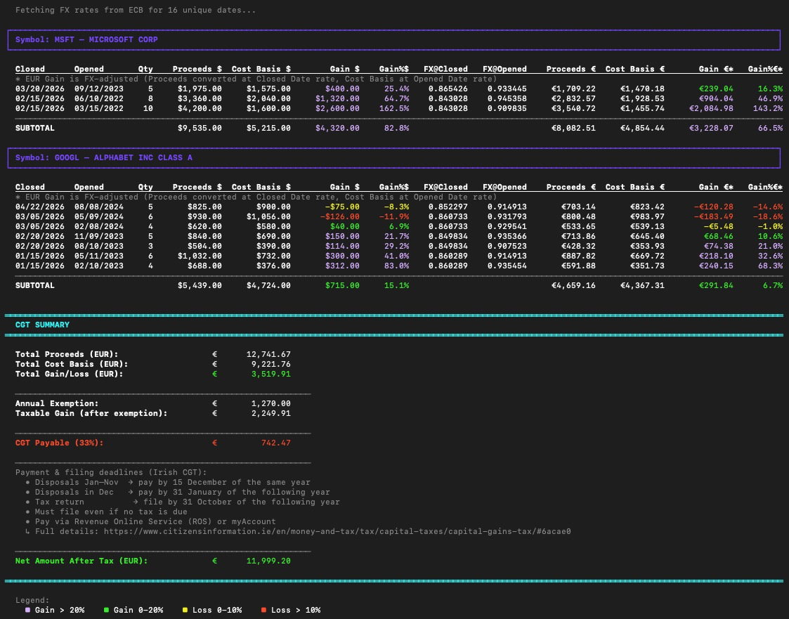

# Schwab CGT Calculator — Ireland

A command-line tool that calculates Irish Capital Gains Tax (CGT) from a Charles Schwab **"Gain/Loss Realized — Detailed"** CSV export. Exchange rates are fetched live from the European Central Bank (ECB) so all figures are reported in EUR alongside the original USD amounts.

## Sample output



## Requirements

- Python 3.8+
- No third-party packages — uses only the standard library (`csv`, `urllib`, `json`, `argparse`)
- Internet access to reach the ECB data API

## How to get the input file

1. Log in to [Schwab.com](https://www.schwab.com) and go to **Accounts → Realized Gain / Loss**.
2. Set the date range you need.
3. Click **Export** icon on the right top corner of the page and choose **Export Details Only** (not the summary variant).
4. Save the downloaded CSV file.

> **Important:** Only the *Detailed* CSV contains the per-lot columns (`Opened Date`, `Closed Date`, `Proceeds`, `Cost Basis`) that the script requires.

## Usage

```bash
python calculate_schwab_cgt_ie.py <path-to-csv>
```

**Example:**

```bash
python calculate_schwab_cgt_ie.py XXXX9719_GainLoss_Realized_Details_20260513.csv
```

A sample CSV (`SAMPLE_GainLoss_Realized_2026.csv`) is included in this repo so you can do a dry run without your real data:

```bash
python calculate_schwab_cgt_ie.py SAMPLE_GainLoss_Realized_2026.csv
```

## What the script does

1. **Parses** the Schwab CSV, grouping transactions by ticker symbol.
2. **Fetches ECB exchange rates** for every unique transaction date (USD → EUR).  
   If a date falls on a weekend or public holiday, the script automatically falls back to the nearest prior business day.
3. **Converts** each lot to EUR using two separate rates:
   | Rate | Date used | Applied to |
   |------|-----------|------------|
   | FX@Closed | Sale date (`Closed Date`) | Proceeds |
   | FX@Opened | Acquisition date (`Opened Date`) | Cost Basis |
4. **Prints a per-symbol table** showing, for each lot:
   - Sale date / acquisition date / quantity
   - Proceeds and cost basis in USD and EUR
   - Gain/Loss in both USD and EUR, with colour-coded percentage
   - The two FX rates used
5. **Prints a CGT summary** that applies Irish tax rules:
   - **CGT rate:** 33%
   - **Annual personal exemption:** €1,270
   - `Taxable Gain = max(0, Total EUR Gain − €1,270)`
   - `CGT Payable = Taxable Gain × 33%`
   - Shows Net Amount After Tax and Irish filing/payment deadlines


## Configurable constants

At the top of `calculate_schwab_cgt_ie.py` you can adjust:

```python
CGT_RATE        = 0.33    # Capital Gains Tax rate (33%)
ANNUAL_EXEMPTION = 1270.0  # Annual personal exemption in EUR
```

## Colour legend

| Colour | Meaning |
|--------|---------|
| Purple | Gain > 20% |
| Green  | Gain 0 – 20% |
| Yellow | Loss 0 – 10% |
| Red    | Loss > 10% |
